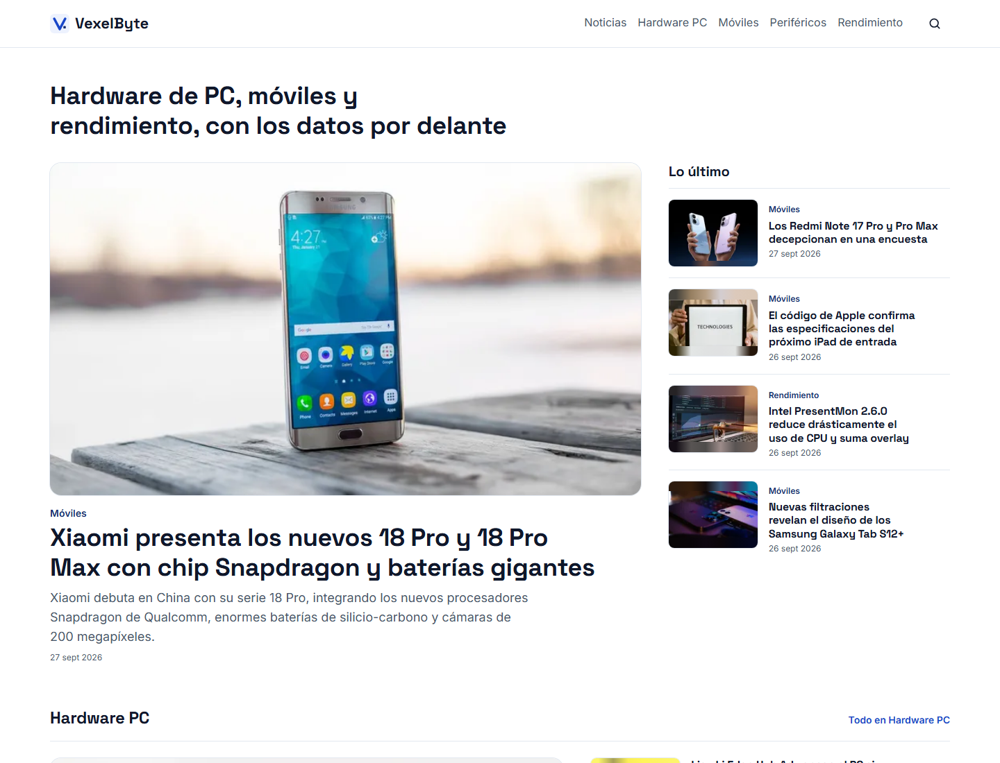
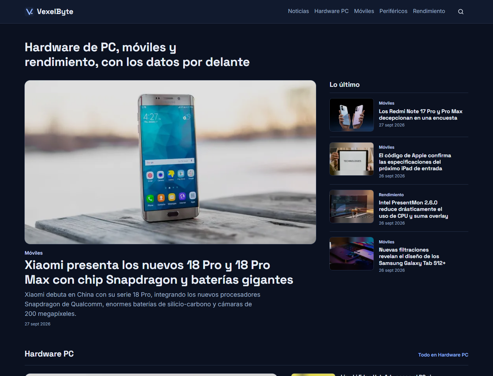
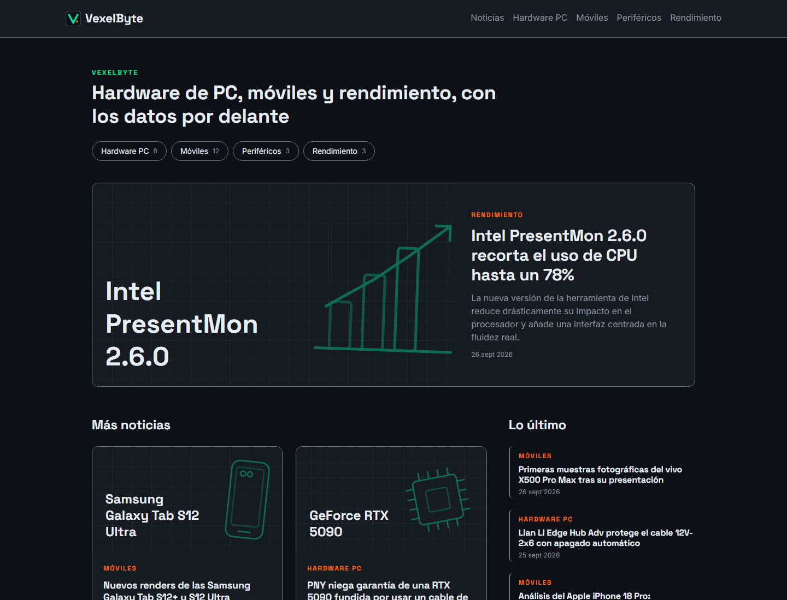
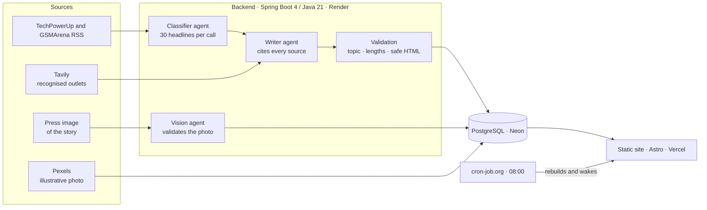
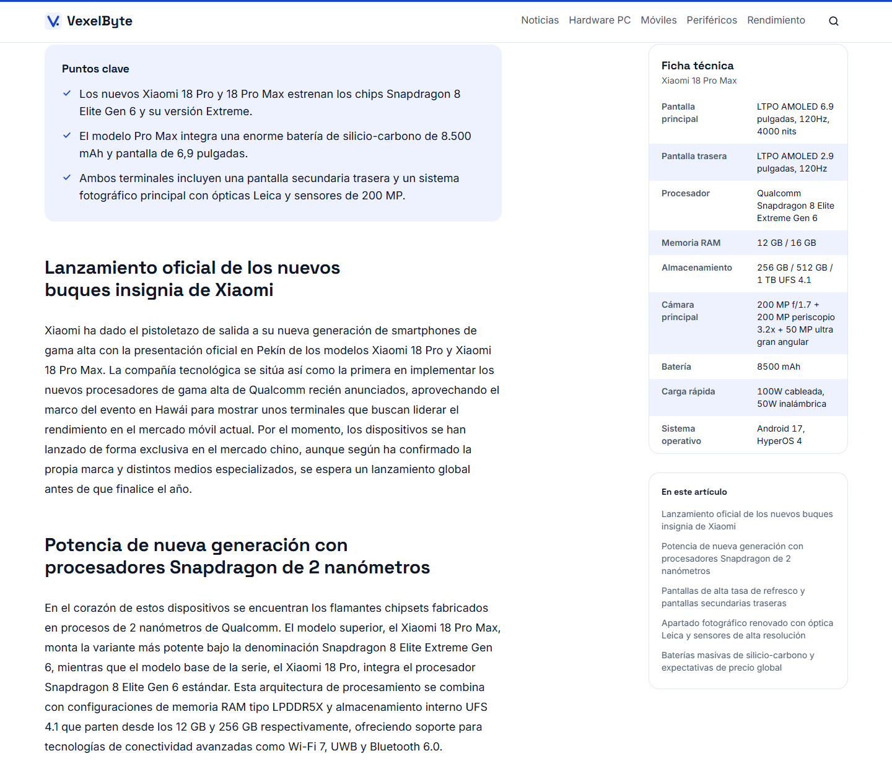
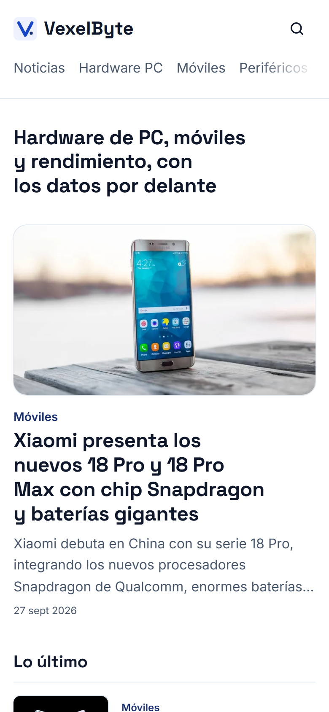

# VexelByte

[Español](README.md) · **English**

**A real hardware news outlet, in production, that writes itself.** I led it end to end working with AI agents: agents inside the product that read, decide, cross-check and write the news, and a coding agent that programmed under my rules and my review.

| Light mode | Dark mode |
| --- | --- |
|  |  |

> The website and its articles are in Spanish, and so are the code identifiers and comments, by design.

## In 30 seconds

- **What it is:** a PC hardware, mobile and performance news site in Spanish that publishes on its own every other day at 08:00. Live at [www.vexelbyte.com](https://www.vexelbyte.com).
- **What the AI does:** reads specialised outlets, drops anything that is not hardware, cross-checks each story against what other outlets published, writes the article citing its sources and picks an official press photo validated by computer vision.
- **What it shows:** that I can run a real product with AI, not a demo: choosing and wiring services together, auditing what the agents produce, solving production incidents and keeping it all on free tiers.

## My role

I directed the project from start to finish. The code was written by a coding agent (Claude Code); the decisions, the auditing and the rollout were mine.

**I designed the product and set the rules.** I wrote the standard the agent had to follow and gave it quality skills for every delivery: performance, accessibility, security, SEO and design. Every change is tested locally first, on a separate branch and against a copy of the database, and only reaches production when I approve it.

**I audited every result, and often rejected it.** A few examples:

- An "iPhone 18 Pro review" was a line of filler: I required that nothing is published without enough source material.
- Articles were short and single-sourced: I asked for every story to be cross-checked with other outlets and for the whole archive to be rewritten.
- Photos were generic or did not fit: I asked for real press material of each product.
- The first palette, black with neon green, looked like a typical AI-generated site: I replaced it with an editorial white-and-blue design, with dark mode following the device.
- Brand and factory news slipped into the PC Hardware section: I tightened the criteria.
- Testing every change in production took 15 minutes: I set up a local environment.

**I researched, chose and configured every service.** I created the accounts, the keys and the domain, and decided how to fit everything into free tiers:

| Service | Used for | Why |
| --- | --- | --- |
| Render | Docker backend | Free Docker tier; it sleeps without traffic, so I designed the system to wake it up |
| Neon | PostgreSQL database | Database branches: production and a copy for development |
| Vercel | Static site and custom domain | Performance and security headers with no server |
| Gemini, Groq and OpenRouter | Chained AI models | If one runs out of free quota, the next one takes over |
| Tavily | Finding what other outlets published | Its terms allow publishing the result, unlike Google search in Gemini |
| Pexels | Licensed illustrative photos | When there is no official press material |
| cron-job.org and GitHub Actions | Publishing on time and rebuilding the site | The free GitHub cron arrived hours late |

**Before and after my audit.** On the left, the first version the agent delivered; on the right, the site after my corrections:

| Before | After |
| --- | --- |
|  |  |

- **Design:** from a dark template with neon green, the typical AI-generated site, to an editorial white-and-blue design of its own, with dark mode following the device.
- **Photos:** from generic drawn covers, with no real photos, to validated press material or a credited illustrative photo in every article.
- **Content:** from one-minute, single-source articles (~250 words) to an average of 440 words with 4 outlets cited.
- **Criteria:** stories like TSMC's manufacturing node, published as if it were new hardware, no longer pass the filter. I removed 15 articles like that.

**I made sure it lasts.** With one story per section every other day and a retention policy (photos after eighteen months, articles after ten years), the database settles at about 160 MB of the free 500.

## How it works

1. **Classifier:** reviews 30 headlines in a single call and only lets through specific hardware products (launches, specs, tests), assigning each one its section.
2. **Writer:** writes in Spanish from the full story, the spec sheet and what recognised outlets have published, naming in the text where every fact comes from. It is forbidden to invent figures or claim tests it did not run.
3. **Validation:** rejects anything that fails and cleans the HTML with an allowlist before storing it.
4. **Vision:** accepts the story's image only if it is official manufacturer material; otherwise it finds an illustrative photo and labels it as such.

| Article with spec sheet and table of contents | Mobile |
| --- | --- |
|  |  |

## Real problems I solved

| Problem | Solution |
| --- | --- |
| The AI wrote a hollow review from a headline alone | Nothing is written without 400 characters of source, and reviews are summarised from what several outlets published, attributing every verdict |
| ~250-word articles with a single source | Coverage from other outlets through Tavily; the archive was rewritten: 47 articles grew to an average of 440 words and 4 sources |
| Content farms and forums were being cited | Only outlets on a recognised list count, and their forums are excluded |
| Wikimedia only had a photo for 3 of 44 articles | A vision agent validates each story's press material, with Pexels as a fallback |
| Deployments failed while downloading third-party images | The backend downloads, compresses and serves every photo; the site depends on nobody else |
| Gemini's free quota is 20 requests a day | A chain of five models with automatic fallback, plus batch classification |
| The GitHub cron published hours late | cron-job.org at 08:00 Madrid time, with no expiring tokens |

## Quality

| Area | Result |
| --- | --- |
| Mobile Lighthouse | 99-100 performance and 100 accessibility, best practices and SEO |
| Backend tests | 163 (unit and end-to-end HTTP) on every push |
| Accessibility | WCAG 2.2 AA in both themes, with every contrast calculated |
| Security | Strict CSP with no external origins, sanitised HTML and no credentials in the repository |
| Privacy | No cookies or analytics, and fonts served from the site's own domain |

## Licence and credits

The code is published so you can view and evaluate it, with [all rights reserved](LICENSE): it may not be reused without my permission. The website's content (articles, brand and images) is not covered by any licence either.

News from [TechPowerUp](https://www.techpowerup.com), [GSMArena](https://www.gsmarena.com) and the outlets each article cites. Photos: each brand's press material and [Pexels](https://www.pexels.com). Space Grotesk and Inter typefaces, under the SIL Open Font License.

## Author

**Rodrigo Cuéllar Londoño** · Second-year student of Web Application Development (DAW, Spain) · [contacto@vexelbyte.com](mailto:contacto@vexelbyte.com)
