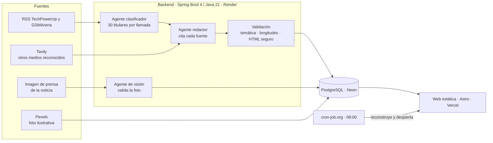

# VexelByte

**Español** · [English](README.en.md)

**Un medio de noticias de hardware real, en producción, que se escribe solo.** Lo he dirigido de principio a fin trabajando con agentes de IA: agentes dentro del producto, que leen, deciden, contrastan y redactan las noticias, y un agente de código, que ha programado bajo mis reglas y mi revisión.

| Modo claro | Modo oscuro |
| --- | --- |
|  |  |

## En 30 segundos

- **Qué es:** un portal de noticias de hardware de PC, móviles y rendimiento, en español, que publica solo cada dos días a las 08:00. Está en línea en [www.vexelbyte.com](https://www.vexelbyte.com).
- **Qué hace la IA:** lee medios especializados, descarta lo que no es hardware, contrasta cada noticia con lo que publican otros medios, redacta el artículo citando sus fuentes y elige una foto de prensa oficial validada por visión artificial.
- **Qué demuestra:** que sé llevar un producto real con IA, no una demo: elegir y conectar servicios, auditar lo que producen los agentes, resolver incidentes en producción y mantenerlo todo en planes gratuitos.

## Mi papel

He dirigido el proyecto de principio a fin. El código lo ha escrito un agente de programación (Claude Code); las decisiones, la auditoría y la puesta en marcha han sido mías.

**Diseñé el producto y fijé las reglas.** Escribí el estándar que el agente debía cumplir y le di skills de calidad para cada entrega: rendimiento, accesibilidad, seguridad, SEO y diseño. Todo cambio se prueba primero en local, en una rama aparte y contra una copia de la base de datos, y solo llega a producción cuando yo lo apruebo.

**Audité cada resultado, y muchas veces lo rechacé.** Algunos ejemplos:

- Un "análisis del iPhone 18 Pro" era una línea de relleno: exigí que sin material suficiente no se publique nada.
- Los artículos eran cortos y de una sola fuente: pedí contrastar cada noticia con otros medios y reescribir todo el archivo.
- Las fotos eran genéricas o no encajaban: pedí material de prensa real de cada producto.
- La primera paleta, negra con verde neón, parecía una web típica generada por IA: la cambié por un diseño editorial en blanco y azul, con modo oscuro según el dispositivo.
- En Hardware PC se colaban noticias de marcas o de fábricas: endurecí el criterio.
- Probar cada cambio en producción costaba 15 minutos: monté un entorno local.

**Investigué, elegí y configuré cada servicio.** Creé las cuentas, las claves y el dominio, y decidí cómo encajar todo dentro de planes gratuitos:

| Servicio | Para qué | Por qué |
| --- | --- | --- |
| Render | Backend en Docker | Plan gratuito con Docker; duerme sin tráfico, así que diseñé el sistema para despertarlo |
| Neon | Base de datos PostgreSQL | Ramas de base de datos: producción y una copia para desarrollo |
| Vercel | Web estática y dominio propio | Rendimiento y cabeceras de seguridad sin servidor |
| Gemini, Groq y OpenRouter | Modelos de IA en cadena | Si uno agota su cuota gratuita, pasa al siguiente solo |
| Tavily | Buscar qué publican otros medios | Sus términos permiten publicar el resultado, a diferencia de la búsqueda de Google en Gemini |
| Pexels | Fotos ilustrativas con licencia | Cuando no hay material de prensa oficial |
| cron-job.org y GitHub Actions | Publicar a su hora y reconstruir la web | El cron gratuito de GitHub llegaba con horas de retraso |

**Antes y después de mi auditoría.** A la izquierda, la primera versión que me entregó el agente; a la derecha, la web tras mis correcciones:

| Antes | Después |
| --- | --- |
|  |  |

- **Diseño:** de una plantilla oscura con verde neón, la típica web generada por IA, a un diseño editorial propio en blanco y azul, con modo oscuro según el dispositivo.
- **Fotos:** de portadas genéricas dibujadas, sin ninguna foto real, a material de prensa validado o foto ilustrativa citada en todos los artículos.
- **Contenido:** de artículos de un minuto con una sola fuente (~250 palabras) a una media de 440 palabras con 4 medios citados.
- **Criterio:** noticias como la del nodo de fabricación de TSMC, que se publicaba como si fuera hardware nuevo, ya no pasan el filtro. Retiré 15 artículos así.

**Calculé que dure.** Con una noticia por sección cada dos días y una política de retención (fotos al año y medio, artículos a los diez años), la base de datos se estabiliza en unos 160 MB de los 500 gratuitos.

## Cómo funciona

1. **Clasificador:** revisa 30 titulares en una sola llamada y solo deja pasar productos de hardware concretos (lanzamientos, especificaciones, pruebas), asignando a cada uno su sección.
2. **Redactor:** escribe en español con la noticia completa, la ficha técnica y lo que han publicado otros medios reconocidos, citando en el texto de dónde sale cada dato. Tiene prohibido inventar cifras o atribuirse pruebas que no ha hecho.
3. **Validación:** rechaza lo que no cumple y limpia el HTML con una lista blanca antes de guardarlo.
4. **Visión:** acepta la imagen de la noticia solo si es material oficial del fabricante; si no, busca una foto ilustrativa y la cita como tal.

| Artículo con ficha técnica e índice | Móvil |
| --- | --- |
|  |  |

## Problemas reales que resolví

| Problema | Solución |
| --- | --- |
| La IA escribió un análisis hueco a partir de solo un titular | Sin 400 caracteres de fuente no se redacta nada, y los análisis se resumen de lo que publican varios medios, atribuyendo cada valoración |
| Artículos de ~250 palabras con una única fuente | Cobertura de otros medios con Tavily; el archivo se reescribió: 47 artículos pasaron a una media de 440 palabras y 4 fuentes |
| Se citaban granjas de contenido y foros | Solo cuentan los medios de una lista reconocida, y se excluyen sus foros |
| Wikimedia solo tenía foto para 3 de 44 artículos | Un agente de visión valida el material de prensa de cada noticia y, si no lo hay, se usa Pexels |
| El despliegue caía al descargar imágenes de terceros | El backend descarga, comprime y sirve cada foto; la web no depende de nadie más |
| La cuota gratuita de Gemini es de 20 peticiones al día | Cadena de cinco modelos con respaldo automático y clasificación por lotes |
| El cron de GitHub publicaba con horas de retraso | cron-job.org a las 08:00 en hora de Madrid, sin tokens que caduquen |

## Calidad

| Área | Resultado |
| --- | --- |
| Lighthouse móvil | 99-100 en rendimiento y 100 en accesibilidad, buenas prácticas y SEO |
| Tests del backend | 163 (unitarios y HTTP de extremo a extremo) en cada push |
| Accesibilidad | WCAG 2.2 AA en los dos temas, con cada contraste calculado |
| Seguridad | CSP estricta sin orígenes externos, HTML saneado y ninguna credencial en el repositorio |
| Privacidad | Sin cookies ni analítica, y tipografías servidas desde el propio dominio |

## Licencia y créditos

El código se publica para que puedas consultarlo y evaluarlo, con [todos los derechos reservados](LICENSE): no se puede reutilizar sin mi permiso. El contenido de la web (artículos, marca e imágenes) tampoco se incluye en ninguna licencia.

Noticias de [TechPowerUp](https://www.techpowerup.com), [GSMArena](https://www.gsmarena.com) y los medios que cita cada artículo. Fotos: material de prensa de cada marca y [Pexels](https://www.pexels.com). Tipografías Space Grotesk e Inter, bajo la SIL Open Font License.

## Autor

**Rodrigo Cuéllar Londoño** · Estudiante de segundo curso de Desarrollo de Aplicaciones Web (DAW) · [contacto@vexelbyte.com](mailto:contacto@vexelbyte.com)
